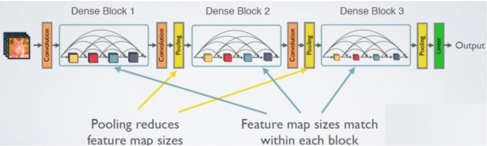

# PlantSeedPrediction
Course Project for CS539[Machine Learning] in WPI

## Authors: 
Weinan Zhi, Yang Mo, Lei Ma, Zhiyi Huang, Yueqin Liang

## Project Description
Plant image identification has become an inter-discipline of botany and computer vision.There is a technical trend.  For example, a Microsoft app will tell you the name of a flower as well as a few other details when you take a picture of a flower. Our project is a cross-border collaboration between plants and machine learning. We used different models to identify a plant from a seed.

The reason why we did this project is because the identification of seeds by traditional methods, which require manually labeling, is difficult, time consuming, and sometimes frustrating. Our project proposed an efficient way to identify seeds with high accuracy. It means that we can improve crop yields, increase price of seeds product and reduce waste.

## Dataset
### Plant Seedlings Dataset
The Original Dataset comes from [Plant Seedlings Dataset](https://arxiv.org/abs/1711.05458). In this project, [V1](https://vision.eng.au.dk/?download=/data/WeedData/Nonsegmented.zip) of the dataset is taken as input. The creater released a second version, [V2](https://vision.eng.au.dk/?download=/data/WeedData/NonsegmentedV2.zip), eliminating the problem that some of the images have more than one seeds. 
Here are some random samples of each spices:

## Preprocessing
### Data Preparation
Since the original dataset is not well normalized, Each image is cropped to 224 * 224 pixels resolution and RGB color theme.
For future classification task, three subsets are created as follow:

**trainingSet** 4750 RGB labeled images with 224\*224 resolution  

**sampleSet** 2371 RGB labeled images with 224\*224 resolution

**testSet** 794 RGB unlabeled images with 224\*224 resolution

After these process, here are several examples:

Since this project will performed on ResNet and DenseNet using Pytorch, the final outputs are transformed into tensor format by Pytorch. For the size purpose, the output is not uploaded, but the [data loader](https://github.com/WeinanZhi/-CS539-PlantSeedPrediction/blob/master/data_loader.ipynb) can do the job in no time and write the output to the current working directory.

The final output should consists of the following five files: 

**sample_X.pt** 2371 tensors corresponding to sampleSet 2371 images

**train_X.pt** 4750 tensors corresponding to trainingSet 4750 images

**test.pt** 794 tensors corresponding to testSet 794 images

**sample_Y.txt** 2371 labels corresponding to sample_X.pt 2371 tensors

**train_Y.txt** 4750 labels corresponding to train_X.pt 4750 tensors

### Data Segmentation
[Segmented Data](https://drive.google.com/drive/folders/19Px2relPjxfPZWV7UGHchqaqXX8RZBRc?usp=sharing)

Outside datasets similar to original datasets have been used for better accuracy. Here is an example:

Segmentation Result:

## Transfer Learning of Image Classification

We used two models, one is ResNet18, the other is DensNet121.

## ResNet18 MOdel

## DenseNet121 Model
The second model we used is DenseNet121 Model.
Compared with RESNET, densenet proposes a more radical dense connection mechanism. That is, all layers are connected to each other, especially, each layer will accept all the previous layers as its additional input.

The network structure of densenet is mainly composed of denseblock and transition. In denseblock, each layer has the same characteristic map size and can be connected in the channel dimension.

## Experiments

GPU: Google Colab

Epochs: 25

Unsegmented data set

Segmented data set

Batch size:4

## Conclusion
We plot all the accuracy in one linechart as below, and get three conclusion.
1. Segmented data performed  better on ResNet18.
2. Segmented data  and original data performed  almost same  on Densenet121.
3. Densenet121 performed better than ResNet18 because of the complicated input structure.

